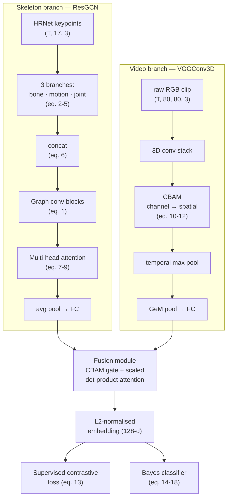

# Gait Recognition — ResGCN + VGGConv3D + CBAM Fusion

[](https://github.com/umaribrahim27/gait-recognition-gcn-fusion/actions/workflows/ci.yml)
[](LICENSE)
[](pyproject.toml)

A PyTorch implementation of a multi-modal gait recognition architecture
described in the accompanying paper (Sec. 3, equations 1–13, and Sec. 4.2,
equations 14–18 for the Bayes classifier): a skeleton branch (ResGCN with
multi-head attention), a video branch (3D convolutions with CBAM), fused
via cross-modal attention and trained with a supervised contrastive loss.

Every core equation is implemented, verified against the paper, and
covered by tests that check actual numerical behaviour — not just output
shapes. The full pipeline (both branches → fusion → loss) is proven
trainable end to end on synthetic data (`tests/test_training_convergence.py`).

## Architecture



## Quickstart

```bash
pip install -r requirements.txt

# run the full test suite (37 tests: equation-level correctness,
# CASIA-B split protocol, and an end-to-end convergence check)
python -m pytest -v

# train each branch on synthetic data (no CASIA-B required) — proves
# the pipeline runs and the loss decreases, in seconds on CPU
python -m training.train_resgcn --demo --epochs 5
python -m training.train_vggconv3d --demo --epochs 5
python -m training.train_fusion --demo --epochs 5

# evaluate a trained checkpoint (Lp-distance baseline + Bayes classifier)
python -m scripts.evaluate --checkpoint checkpoints/fusion_best.pt --demo
```

To train on real CASIA-B data instead, point at a dataset root laid out as
described in `data/casia_b.py` and drop `--demo`:

```bash
python -m training.train_resgcn --config configs/resgcn.yaml --data-root /path/to/casia-b
```

## Verification against the paper, equation by equation

| # | Item | Match | Notes |
|---|---|---|---|
| 1 | Graph conv layer (eq. 1) | **Matches** | `models/resgcn/graph_conv.py`: precomputes `D~^{-1/2} A~ D~^{-1/2}` with `A~ = A + I` in `data/graph.py:normalized_adjacency`, applies it via `einsum` before the learnt `Theta` (1×1 conv), then BN + activation, in that order. Numerically verified against a manually-derived formula in `tests/test_graph_conv.py`. |
| 2 | Multi-branch inputs (eq. 2–5) | **Matches, with two resolved ambiguities** | `models/resgcn/branches.py` computes bone length (eq. 2), bone angle (eq. 3), motion velocity (eq. 4), and joint position (eq. 5) as three genuinely separate branches — bone (length+angle, 6ch), motion (6ch), joint (3ch) — each independently batch-normed and passed through its own graph-conv block *before* `concat_branches` implements eq. 6. Two ambiguities resolved and documented inline: (a) eq. 3 divides a 3-vector by a scalar norm then takes `arccos`, applied element-wise per axis (direction cosines); (b) eq. 5's "pose centre c" is undefined in the paper — the per-frame joint centroid is used. Value-level checks (not just shapes) in `tests/test_branches.py`. |
| 3 | Multi-head attention (eq. 7–9) | **Matches** | `models/resgcn/attention.py`: each of `P` heads has its own independent `W_Q`, `W_K`, `W_V` linear layers (`nn.ModuleList`, not shared weights), scaling is `1/sqrt(D)` with `D = proj_dim` per eq. 8, heads are concatenated and passed through one final linear `W_0` per eq. 9. `tests/test_attention.py` reproduces the equations by hand and checks an exact match against the module's forward pass. |
| 4 | CBAM (eq. 10–12) | **Matches the paper's prose; extends the literal equations** | `models/vggconv3d/cbam.py`: `ChannelAttention` runs strictly before `SpatialAttention` (sequential, not parallel), matching Sec. 3.3.1 — verified in `tests/test_cbam.py` by comparing against explicit sequential composition. The literal eq. 10–12 only show an average-pooling path; Sec. 3.3.1's prose explicitly says both avg- and max-pooled features are used, so the standard dual avg+max CBAM is implemented (a superset of the equations, not a deviation from them). |
| 5 | Supervised contrastive loss (eq. 13) | **Matches** | `losses/supervised_contrastive.py`: `P(i)` is every other sample in the batch sharing `i`'s label (multiple positives, not a single positive/negative pair as in triplet loss), `A(i)` is all samples other than `i`. `tests/test_loss.py` checks the multi-positive averaging matches a hand-computed value, that separated classes score lower loss than collapsed ones, and that gradient descent actually reduces it. Implemented as a numerically stable log-sum-exp, mathematically identical to the paper's ratio-of-exponentials form. |
| 6 | HRNet integration | **Not a placeholder, but not exercised** | `data/hrnet_extract.py` wraps OpenMMLab's `mmpose` (`init_model` / `inference_topdown`) — the actual pretrained HRNet implementation and COCO checkpoint format the paper references, not a from-scratch reimplementation. `mmpose`/`mmcv` were **not installed** and no checkpoint downloaded in this environment (no CASIA-B data present to run it on), so this module is untested here. Everything downstream only depends on its documented output contract: `(17, 3)` = `(x, y, confidence)` per frame. |

## Reported results (from the paper, not reproduced here)

The paper reports the following Rank-1 accuracies on CASIA-B (large-sample
protocol), reproduced here for reference only — this repo has not been
trained on real CASIA-B data (see below):

| Model | NM | BG | CL | Average |
|---|---|---|---|---|
| GaitGL (ICCV'21) | 97.4 | 94.5 | 83.8 | 91.9 |
| DANet (CVPR'23) | 98.0 | 95.9 | 89.9 | 94.6 |
| MMGaitFormer (CVPR'23) | 98.4 | 96.0 | 94.8 | 96.4 |
| **This paper** | **99.4** | **97.1** | **95.7** | **97.4** |

`scripts/evaluate.py` computes this same breakdown (via `evaluation/metrics.py`
and the Bayes classifier) for any checkpoint trained on real data.

## What's implemented vs. necessarily inferred

**Implemented and equation-verified:** graph convolution (eq. 1),
multi-branch inputs + concat (eq. 2–6), multi-head attention (eq. 7–9),
CBAM (eq. 10–12), supervised contrastive loss (eq. 13), Bayes classifier
(eq. 14–18), the full fusion pipeline, a training loop (Adam + 1-cycle LR
per Sec. 4.2), the CASIA-B 74/50 subject split and gallery/probe protocol
(Sec. 4.1), and pose/video augmentations (Sec. 3.1).

**Necessarily inferred or deferred** (the paper doesn't specify these
precisely enough to implement without an assumption, or they require
resources — real CASIA-B data, a downloaded HRNet checkpoint, a GPU for a
200-epoch run — not available in this environment):

- **CASIA-B on-disk layout.** The paper describes the *evaluation
  protocol* but not a file format; `data/casia_b.py` assumes a
  `subject/condition-seq/view/` layout, documented in its docstring.
- **HRNet checkpoint.** Real integration code exists (`data/hrnet_extract.py`,
  wrapping `mmpose`), but no checkpoint was downloaded or run.
- **Skeleton adjacency / bone-parent topology.** The paper says the graph
  is built via "spatial partitioning" but never enumerates the 17-joint
  edge list; `data/graph.py` uses a standard COCO-17 nose-rooted kinematic
  tree.
- **Model dimensions** (ResGCN main-stream channel widths, VGGConv3D conv
  depth/channel widths) — the paper describes these only at a macro level;
  the specific numbers used are standard defaults, not values from the paper.
- **Fusion input granularity.** Fig. 1 suggests CBAM sits between branches
  before final pooling, but gives no feature-map shapes there; this
  implementation applies CBAM/fusion on each branch's final `(B, 128)`
  embedding instead, so `models/fusion/cbam_fusion.py` only implements the
  channel-gating half of CBAM (no spatial axis remains at that point).
- **Bayes classifier covariance.** Eq. 15 specifies a full covariance
  matrix; with a 128-d embedding and few gallery samples per class this is
  singular, so a diagonal covariance is used by default
  (`diagonal_covariance=True`).
- **Augmentation parameter values** (noise scale, translation range, flip
  probability) and **normalisation constants** (mean/std) — described only
  qualitatively in Sec. 3.1; reasonable defaults are used, all overridable.
- **Full experiment reproduction** (200 epochs, batch sizes 512/128, on
  real CASIA-B) is not run — this would require a GPU and the dataset.

## Testing

37 tests, `python -m pytest -v`:

- `test_graph_conv.py`, `test_branches.py`, `test_attention.py`,
  `test_cbam.py`, `test_loss.py` — per-equation numerical correctness
  (not just shapes): exact matches against hand-derived formulas, gate
  value ranges, gradient-descent behaviour.
- `test_smoke.py` — full pipeline forward/backward pass at the paper's
  stated shapes (T=59, N=17, embedding 128).
- `test_casia_b.py` — split-protocol correctness plus a synthetic on-disk
  fixture proving the dataset loader's directory walking and padding work.
- `test_training_convergence.py` — trains the full pipeline on separable
  synthetic data and asserts the loss decreases.

CI (`.github/workflows/ci.yml`) runs `ruff` + the full suite on every push,
across Python 3.10 and 3.11.

## Repo layout

```
data/            graph construction, CASIA-B loader, transforms, HRNet adapter, synthetic dataset
models/resgcn/   equations 1-9
models/vggconv3d/ equations 10-12, temporal max pool, GeM
models/fusion/   CBAM channel gate + scaled dot-product attention fusion
losses/          equation 13
evaluation/      equations 14-18, rank-1 metrics
training/        Adam + 1-cycle LR trainer, per-branch CLI entrypoints
scripts/         evaluation entrypoint
configs/         per-branch hyperparameters (from Sec. 4.2 where specified)
tests/           37 tests: equation correctness, data loading, convergence
```
